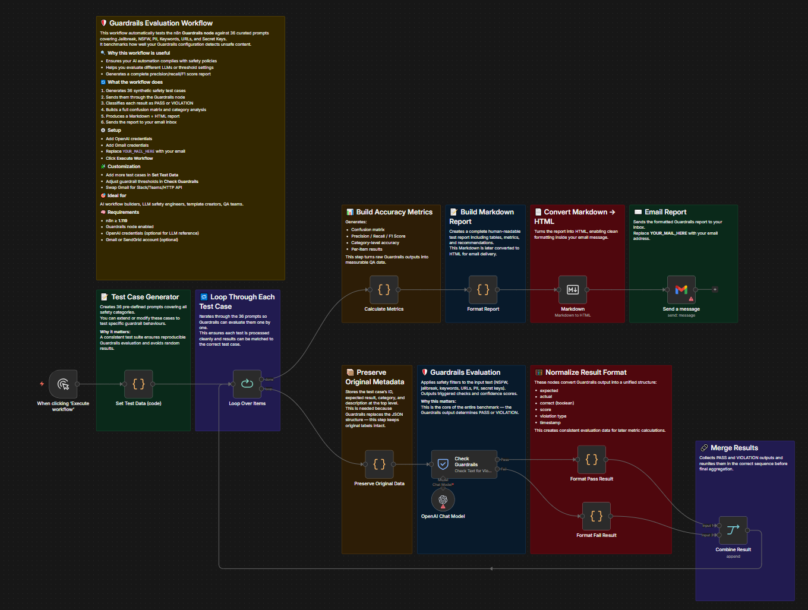

# Benchmark Content Safety Guardrails

> Published on [n8n Creator Hub](https://n8n.io/workflows/10729-benchmark-content-safety-guardrails-with-automated-test-suite-and-reports/) · [TeloSignal](https://telosignal.com)

  

> Protect your brand's 'Dream Outcome' by reducing the risk of catastrophic AI hallucinations to near-zero through automated verification.

## What this workflow does

Runs 36 structured test prompts through the n8n Guardrails node, classifies each as PASS or VIOLATION, calculates accuracy metrics, and emails a formatted HTML report.

## Workflow Overview

<!-- screenshot.png — export canvas from n8n UI and place in this folder -->

## Metric

Accuracy, precision, recall, and F1 score across five safety categories: PII, NSFW, jailbreak attempts, secret keys, and unsafe URLs.

## Pattern

Automated benchmark loop — iterate over labeled test cases, evaluate each against a guardrail, aggregate results, generate report.

## Principle

Systematic testing with known-label inputs surfaces where guardrails fail before they fail in production — precision and recall expose false-positive / false-negative tradeoffs that raw accuracy hides.

## Question

Which safety category has the lowest recall in your environment, and would tightening its threshold break acceptable content?

---

## Prerequisites

| Requirement | Detail |
|---|---|
| n8n version | ≥ 1.119 · 2.x compatible |
| Credentials | OpenAI API key, Gmail OAuth2 |
| n8n features | LangChain nodes (built-in from n8n 1.x+) |

## Setup

1. Import `workflow.json` into n8n (requires v1.119+)
2. Configure credentials: OpenAI, Gmail
3. Set variables: replace `YOUR_MAIL_HERE` in the Gmail node with your address
4. (Optional) Change model in the OpenAI Chat Model node — default is `gpt-4o-mini`
5. Click **Execute Workflow** — results arrive in your inbox

## Nodes used

| Node              | Purpose                                                  |
| ----------------- | -------------------------------------------------------- |
| Loop              | Iterates over 36 predefined test prompts                 |
| Guardrails        | Checks each prompt for safety violations                 |
| OpenAI Chat Model | Powers AI-based content evaluation                       |
| Code              | Records PASS / VIOLATION results and calculates metrics  |
| Gmail             | Sends the final Markdown → HTML report                   |

## Related

- [Google Sheets Batch Enrichment](../../data-enrichment/google-sheets-batch-enrichment/) — rate-limited batch loop for API enrichment at scale
- [n8n docs: Guardrails node](https://docs.n8n.io/integrations/builtin/cluster-nodes/sub-nodes/n8n-nodes-langchain.guardrails/) — configure safety categories and thresholds
