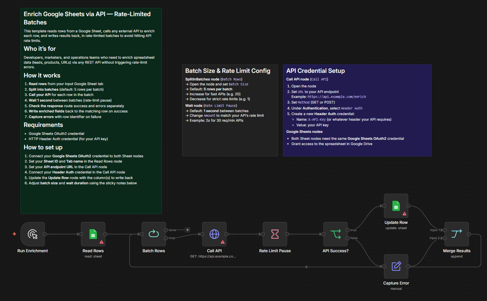

# Google Sheets Batch Enrichment

> Published on [n8n Creator Hub](https://n8n.io/creators/patrickn8n/) · [TeloSignal](https://telosignal.com)

  

> Enrich entire spreadsheets at scale without triggering rate limits — turning a manual API-per-row task into a hands-off batch pipeline.

## What this workflow does

Reads every row from a Google Sheet, calls a configurable REST API once per row in rate-limited batches, then writes enriched data back to the sheet or logs errors.

## Workflow Overview

<!-- screenshot.png — export canvas from n8n UI and place in this folder -->

## Metric

Rows enriched per run with 0 rate-limit errors — measured as successful API responses written back to the sheet vs. rows logged as failures.

## Pattern

Rate-limited batch loop: split rows → call API per row → wait between batches → write successes back → log failures → repeat until done.

## Principle

Batching with enforced waits prevents rate-limit errors. Routing success and failure to separate branches keeps the sheet clean and makes errors traceable without stopping the run.

## Question

Which other data source would you enrich this way — a CRM export, a lead list, or a product catalog?

---

## Prerequisites

| Requirement | Detail |
|---|---|
| n8n version | ≥ 1.0 · 2.x compatible |
| Credentials | Google Sheets OAuth2, Header Auth (for external API) |
| n8n features | None — core nodes only |

## Setup

1. Import `workflow.json` into n8n
2. Configure credentials:
   - Google Sheets OAuth2 (connect to both Sheet nodes)
   - Header Auth credential for your external API
3. Set variables:
   - Sheet ID and tab name in the **Read Rows** node
   - API endpoint URL in the **Call API** node
   - Batch size and wait duration via sticky notes inside the workflow
   - Column(s) to write back in the **Update Row** node
4. Activate

## Nodes used

| Node                       | Purpose                                                          |
|----------------------------|------------------------------------------------------------------|
| Google Sheets (Read Rows)  | Reads all rows from the source sheet                             |
| Split In Batches           | Splits rows into configurable-size batches                       |
| HTTP Request               | Calls external REST API once per row (GET or POST, Header Auth)  |
| Wait                       | Pauses 1 second between batches to respect rate limits           |
| Google Sheets (Update Row) | Writes enriched data back to the sheet on success                |
| Error Logger               | Captures and logs failed API calls separately                    |
| Error Trigger              | Activates on workflow failure; routes to notification/log node   |

## Related

- [Smart Sales Invoice Processor](../../data-processing/smart-sales-invoice-processor/) — ETL pipeline with webhook intake and duplicate detection
- [n8n docs: HTTP Request node](https://docs.n8n.io/integrations/builtin/core-nodes/n8n-nodes-base.httprequest/) — authentication options and dynamic URL patterns
