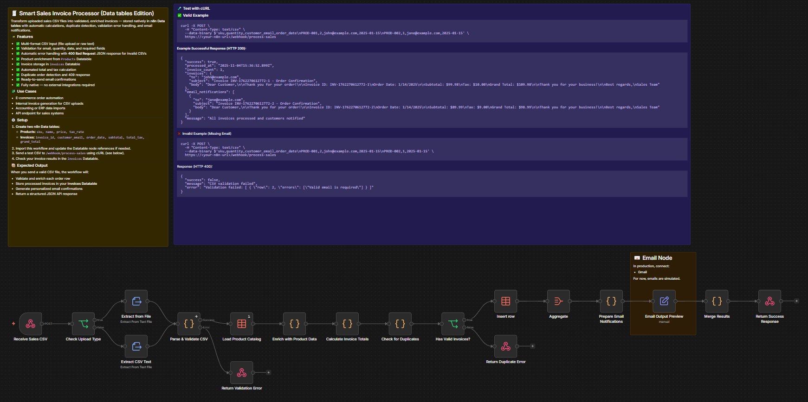

# Smart Sales Invoice Processor

> Published on [n8n Creator Hub](https://n8n.io/creators/patrickn8n/) · [TeloSignal](https://telosignal.com)

  

> Reduce payment time-delays and administrative effort by 80%, turning a brittle manual billing process into a durable, scalable revenue engine.

## What this workflow does

Transforms uploaded sales CSV files into validated, enriched invoices stored in n8n Data tables with automated email notifications.

## Workflow Overview

<!-- screenshot.png — export canvas from n8n UI and place in this folder -->


## Metric

Invoices created per CSV upload — with structured HTTP responses (200 success, 400 validation error, 409 duplicate) confirming exactly what was processed or rejected.

## Pattern

ETL + business automation: CSV ingestion → validation → product enrichment → per-customer invoice calculation → duplicate detection → Data table storage → email preparation → JSON response.

## Principle

Validation-first catches bad data before any processing occurs, returning structured errors immediately. Native Data tables eliminate external dependencies, keeping the entire pipeline inside n8n.

## Question

What would you automate next — real email delivery via Gmail/SMTP, or a dashboard pulling from the Invoices Data table?

---

## Prerequisites

| Requirement | Detail |
|---|---|
| n8n version | ≥ 1.0 · 2.x compatible |
| Credentials | None — fully native n8n |
| n8n features | Data tables (built-in from n8n 1.x+) |

## Setup

1. Create two n8n Data tables:

**Products**

| Column   | Type   | Example        |
|----------|--------|----------------|
| sku      | String | PROD-001       |
| name     | String | Premium Widget |
| price    | Number | 49.99          |
| tax_rate | Number | 0.10           |

**Invoices**

| Column         | Type     | Example              |
|----------------|----------|----------------------|
| invoice_id     | String   | INV-20251103-001     |
| customer_email | String   | john@example.com     |
| order_date     | Date     | 2025-01-15           |
| subtotal       | Number   | 99.98                |
| total_tax      | Number   | 10.00                |
| grand_total    | Number   | 109.98               |
| created_at     | DateTime | 2025-11-03T08:00:00Z |

2. Import `workflow.json` into n8n
3. Configure credentials: none required (fully native)
4. Activate and test:
   ```bash
   curl -X POST \
     -H "Content-Type: text/csv" \
     --data-binary $'sku,quantity,customer_email,order_date\nPROD-001,2,john@example.com,2025-01-15' \
     https://<your-n8n-url>/webhook/process-sales
   ```

## Nodes used

| Node | Purpose |
|------|---------|
| Webhook | Receives CSV upload (file or raw text) |
| Code | Parses and validates CSV rows (email, quantity, date, required fields) |
| Data table (read) | Loads product price and tax rate by SKU |
| Code | Calculates subtotal, tax, and grand total per customer |
| Data table (read) | Duplicate order detection |
| Data table (insert) | Saves validated invoices |
| Code | Builds personalized email confirmation per invoice |
| Respond to Webhook | Returns structured JSON (200 / 400 / 409) |

## Related

- [Google Sheets Batch Enrichment](../../data-enrichment/google-sheets-batch-enrichment/) — rate-limited batch loop for API enrichment at scale
- [n8n docs: Data Tables](https://docs.n8n.io/data/data-table/) — create, query, and manage native n8n data stores
